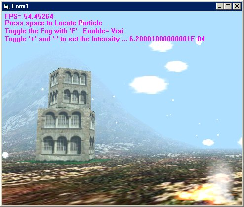



## JohnaDX7 3d engine update \(sorry for last update error\)

### Description

Since my last update submission failed

i try one more time to submit

This update of My DirectX7 3d engine

For people who don't know JohnaDX7 engine:

my engine handles with 3dsound,Xfile,Axis Aligned Bounding-Box,Great landscape engine with hi-collision detection,cool particle system for generating smoke,fire,snow,fountain,explosion..

This update shows a faster landscape with particle and Xfile with great collision detection..

So check it out at this link

http://www.planetsourcecode.com/vb/scripts/ShowCode.asp?txtCodeId=33002&lngWId=1

Pleaze VOTE and LEAVE FEEDBACKS at this link
 
### More Info
 

             |
---                |---
**Submitted On**   |2002-03-23 23:47:26
**By**             |[polaris](https://github.com/Planet-Source-Code/PSCIndex/blob/master/ByAuthor/polaris.md)
**Level**          |Advanced
**User Rating**    |5.0 (15 globes from 3 users)
**Compatibility**  |VB 4\.0 \(32\-bit\), VB 5\.0, VB 6\.0
**Category**       |[DirectX](https://github.com/Planet-Source-Code/PSCIndex/blob/master/ByCategory/directx__1-44.md)
**World**          |[Visual Basic](https://github.com/Planet-Source-Code/PSCIndex/blob/master/ByWorld/visual-basic.md)
**Archive File**   |[JohnaDX7\_3662163282002\.zip](https://github.com/Planet-Source-Code/polaris-johnadx7-3d-engine-update-sorry-for-last-update-error__1-33160/archive/master.zip)

### API Declarations

some GDI

